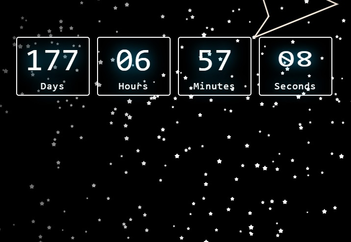

# CanvasCountDown

## Demo

[**click live demo of the project**](https://dominiksiejka.github.io/CanvasCountDown)



## Table of Content

- [About the Project](#description)
- [How to use](#how-to-use)
- [Technologies used](#built-with)
- [Setup steps](#setup)
- [Sources](#sources)
- [License](#license)

## Description

CanvasCountDown is an animation based on HTML Canvas with count down base od Date object.

## How to use

Just watch.

## Built with

- HTML5
- CSS
- Canvas
- Vanilla JavaScript

## Setup

```
with BASH

# clone the remote repo to your local one
$ git clone https://github.com/dominiksiejka/CanvasCountDown.git

# open the index.html file or use your code editor to open it with live server

```

## Sources

- Icons from [Font Awesome ](https://fontawesome.com)
- Font from [Google Fonts ](https://fonts.google.com/)

## License

- MIT © [Dominik Siejka ](https://github.com/dominiksiejka/CanvasCountDown)
